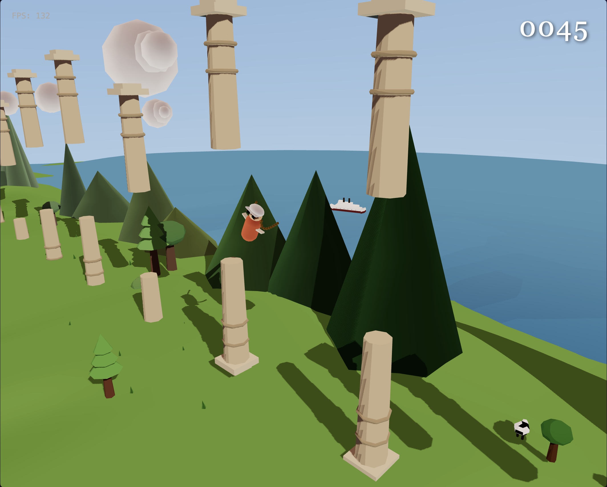

# Flappy Anna 3D

A 3D Flappy Bird side-scroller with a Zelda-inspired anime aesthetic. Entirely built through natural language prompting with **DeepSeek V4 Pro** — all code, from the game loop to the procedural terrain, was generated by AI. Powered by Three.js, Vite, and TypeScript.

This is a 3D upgrade of a [2D Flappy Bird game](https://github.com/guiguan/flappy-anna) built 8 years ago.



## Play

```bash
npm install
npm run dev
```

Open `http://localhost:5173`. Press **Space** or tap to start and flap. Avoid the stone pillars. Score points by passing through the gaps.

## Visual Style

- 2.5D side-scrolling camera with cel/toon shading
- Procedural landscape: rolling contour terrain, mountains, trees, bushes, and grass on both sides of the player path
- Ocean horizon with animated waves and cruise ships
- Sheep and cows wander the fields with leg animation and obstacle avoidance
- Dynamic sky with stylized sun and clouds
- Atmospheric fog and per-object distance-based color fading

## Project Structure

```
src/
├── main.ts              Entry point, scene setup, game loop
├── Game.ts              State machine (Title / Game / GameOver)
├── gameState.ts         Physics, scoring, state transitions
├── constants.ts         Gameplay and rendering constants
├── InputManager.ts      Keyboard, mouse, touch input
├── audio/
│   └── AudioManager.ts  Web Audio API with oscillator fallbacks
├── rendering/
│   ├── ToonMaterial.ts  Cel-shading gradient map
│   └── WaterMaterial.ts Animated ocean shader
├── systems/
│   ├── AnimalSpawner.ts     Sheep & cows with wander AI
│   ├── BoatSpawner.ts       Cruise ships with wave physics
│   ├── CollisionSystem.ts   AABB collision detection
│   ├── EnvironmentSpawner.ts Trees, bushes, grass, mountains
│   ├── ObstacleSpawner.ts   Pillar spawning with object pooling
│   ├── ParticleSystem.ts    Fireflies and particle effects
│   └── TerrainSpawner.ts    Dynamic procedural ground
└── utils/
    └── ProceduralGeo.ts All procedural geometry generators
```

## Tech Stack

- **Three.js** — 3D rendering
- **Vite** — Dev server and bundler
- **TypeScript** — Type-safe game code
- **Web Audio API** — Sound with synthesized fallbacks
